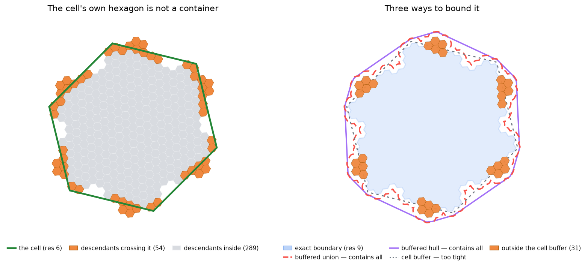

# Buffered Polygons
{: .no_toc }

One polygon that provably contains a cell and every descendant it will ever have — three ways to build one, and what each is worth.
{: .fs-6 .fw-300 }

<details open markdown="block">
  <summary>Table of contents</summary>
  {: .text-delta }
- TOC
{:toc}
</details>

---

## The problem

An H3 cell's `cell_to_boundary` is a plain hexagon. Its descendants are **not** inside that hexagon — they tile a wobbly shape that crosses it in both directions.



Use the hexagon as a filter and you get wrong answers: cells that genuinely belong to the parent test as outside it. A **buffered polygon** fixes that — take a shape, push its edges outward far enough, and every descendant is inside.

How far is "far enough"? Measure it. For a resolution-6 cell, the furthest a descendant strays beyond its hexagon:

| Descendants at | Crossing the hexagon | Furthest excursion |
|---|---|---|
| res 9 | 54 of 343 (16%) | 677 m |
| res 11 | 1,278 of 16,807 (7.6%) | 689 m |
| res 13 | 54,846 of 823,543 (6.7%) | 691 m |

**The excursion converges.** It is not a function of how deep you go — it is a fixed property of the cell's shape, about **0.19 × its edge length** (690 m against 3,724 m here). That single number is what any container has to clear, and it explains everything on this page.

---

## Why buffer at all, if you already traced the boundary?

A fair objection: the accurate function computes every boundary child anyway, so the buffer saves no work at that step. What does it add?

**A traced boundary has an expiry date.** Trace at resolution 9 and you get a shape that is right *for resolution-9 cells*. Look deeper and the wobble grows past it:

| Descendants at | Outside the exact res-9 boundary | Outside the same boundary, buffered |
|---|---|---|
| res 10 | 189 | **0** |
| res 11 | 384 | **0** |
| res 12 | 1,484 | **0** |

The buffer removes the expiry. One edge length of margin and the shape holds for resolution 10, 12, 15 — any depth, permanently.

**That is the saving, and it is large.** Without a buffer, the only way to be safe for resolution-15 data is to trace all the way to resolution 15:

| Approach | Cells to trace | Valid for |
|---|---|---|
| trace at res 9, then buffer | **78** | every depth |
| trace at res 15, no buffer | **59,046** | every depth |

Same guarantee, 757× less work. The buffer is not buying you a shortcut past the boundary children — it is buying you a shortcut past the *depth* of them.

### Buffering is not simplification

Worth stating plainly, because the two are easy to conflate: buffering **adds** vertices. It rounds off every corner with a small arc, so the outline gets heavier, not lighter.

| Traced at | Exact | After buffering |
|---|---|---|
| res 8 | 55 verts | 369 |
| res 10 | 487 verts | 3,033 |
| res 12 | 4,375 verts | 27,009 |

Three independent dials, then:

| Dial | Controls |
|---|---|
| `intermediate_res` | accuracy *and* vertex count — lower is coarser and lighter |
| `buffer_meters` | validity at unlimited depth — the safety margin |
| `use_convex_hull` | speed, paid for in extra area |

They compose. Tracing at res 8 *and* buffering gives a 369-point polygon that still contains every res-15 descendant — light, rough, and safe.

---

## Which one should I use?

| If you want… | Use | Contains everything? |
|---|---|---|
| A polygon you can trust as a filter | `get_buffered_boundary_polygon(cell, res)` | **Yes** |
| The same, fast, and allowed to be generous | `..._cpp(cell, res, use_convex_hull=True)` | **Yes** (21% more area) |
| The exact footprint, no margin | `cell_boundary_from_children(cell, res)` | It *is* the footprint |
| A rough outline of one cell, cheaply | `get_buffered_h3_polygon(cell)` | **No** — see below |

---

## 1. Trace, merge, buffer — the accurate one

**`get_buffered_boundary_polygon(cell, intermediate_res=10, buffer_meters=None)`**

Three steps:

```
1. trace     children_on_boundary_faces(cell, intermediate_res)
                └─ the real boundary, wobble included          (see Boundary Algorithms)

2. merge     union those cells into one polygon
                └─ H3's cells_to_h3shape, or Boost.Geometry in the C++ path

3. buffer    push the edges out by buffer_meters
                └─ default: one edge length at intermediate_res
```

Step 1 is where the straddle is already handled: the traced boundary *includes* the cells that cross the hexagon, so the polygon starts out in the right place. The buffer then only has to cover what is left — the wiggle finer than `intermediate_res`.

That is why the margin can be small. Buffering the hexagon would need ~690 m; buffering the traced boundary at res 10 needs only **76 m**, because the first 690 m of error was removed by tracing rather than by padding.

## 2. Convex hull — the fast one

**`get_buffered_boundary_polygon_cpp(cell, res, buffer_meters, use_convex_hull=True)`**

Identical except step 2: instead of unioning the boundary cells, take the **convex hull** of their vertices. About 20× faster (0.4 ms against 7.6 ms) and yields 61 vertices instead of ~2,000.

The cost is area, not correctness. A hull cannot follow the hexagon's concave wobble, so it covers ground the cell does not occupy — 21% more than the exact footprint, against 6–7% for the union. Good for pre-filtering candidates before an exact test, for drawing, or for bounding a database query.

This mode is **C++-only**; the pure-Python function always unions. Guard with `cpp_geom_available()`.

## 3. Buffering the hexagon — the cheap one

**`get_buffered_h3_polygon(cell, buffer_meters=None)`**

Skips the boundary entirely and buffers the cell's own hexagon. Fast (0.2 ms) and small (71 vertices) — but its default margin is the edge length four resolutions finer, **76 m**, and we just measured that descendants stray **690 m**. So it does not contain them:

| `buffer_meters` | Margin | Descendants left outside (of 16,807) |
|---|---|---|
| `None` (default) | 76 m | 896 |
| `400` | 400 m | 168 |
| `700` | 700 m | **0** |

If you need this function *and* containment, pass roughly **0.2 × the cell's edge length** yourself. Otherwise treat it as answering "roughly where is this cell", not "does this cell contain that point".

---

## Measured

Resolution-6 parent, `intermediate_res=10`, tested against all 16,807 descendants at resolution 11:

| Function | Time | Vertices | Area vs exact | Left outside |
|---|---|---|---|---|
| `get_buffered_boundary_polygon` (union, Python) | 6.0 ms | 3,033 | 1.07× | **0** |
| `get_buffered_boundary_polygon_cpp` (union) | 7.6 ms | 1,937 | 1.06× | **0** |
| `get_buffered_boundary_polygon_cpp` (hull) | 0.4 ms | 61 | 1.21× | **0** |
| `get_buffered_h3_polygon` | 0.2 ms | 71 | 1.05× | 896 |

Note the last row: the cell buffer has the *smallest* area of the four and still fails. Area is not the measure of a container — where the area sits is.

Cost grows with the boundary, so coarse parents traced finely are expensive:

| Parent res | Boundary cells at res 12 | Union |
|---|---|---|
| 8 | 240 | 11 ms |
| 7 | 726 | 54 ms |
| 6 | 2,184 | 174 ms |
| 5 | 6,558 | 673 ms |
| 4 | 19,680 | 2,425 ms |

`intermediate_res` is the dial: higher hugs the true shape more closely and shrinks the auto-margin, but there are more cells to merge. The default of 10 suits parents around resolution 5–7; for coarser parents, raise it — or use the hull.

---

## Choosing the margin

Left as `None`, it is computed for you:

- `get_buffered_boundary_polygon` — **100% of the edge length at `intermediate_res`**. Since the traced boundary is already correct to within one cell at that resolution, one full edge length covers every finer descendant, at any depth.
- `get_buffered_h3_polygon` — the edge length four resolutions below the cell, which as shown above is not enough for containment.

Pass `buffer_meters` to override, or `0` to skip buffering and get the merged boundary itself.

---

## Caveats

- **The guarantee is about descendants, not about the drawn hexagon.** A buffered boundary polygon can exclude slivers of `cell_to_boundary`'s hexagon — about 1.5% of its area in the example above — because that hexagon is only an approximation of the true footprint and pokes outside it in places. Every actual descendant is still inside. If you need the drawn hexagon covered as well, use `get_buffered_h3_polygon` with a generous margin, or take the union of both.
- **Metres are converted to degrees** with one scale factor per polygon, averaging the latitude and longitude scales. Containment held in every test — equator, mid-latitude, Stockholm, 75°N — but treat `buffer_meters` as close, not survey-grade.
- **Antimeridian cells are not handled.** Coordinates stay in [-180, 180], so a polygon spanning the date line renders as a band across the map. Affects a small number of Pacific cells.
- **Pentagons** work, but their footprint is five-sided, so the hull is a looser fit than for hexagons.

---

## How it is verified

- `tests/python/test_buffering.py` tests containment directly: every vertex of every descendant must fall inside, at four latitudes, for the union and hull modes alike. It also pins the two surprises on this page — that `get_buffered_h3_polygon` does *not* contain them, and that a buffered boundary need not cover the drawn hexagon — so neither can silently change.
- Both backends must return the same polygon — `tests/python/test_parity.py` compares them by symmetric-difference area, and checks validity and ring closure.
- `notebook/buffered_polygon_demo.ipynb` reproduces the containment table and the map above; `docs/generate_buffering_figure.py` regenerates the figure.
