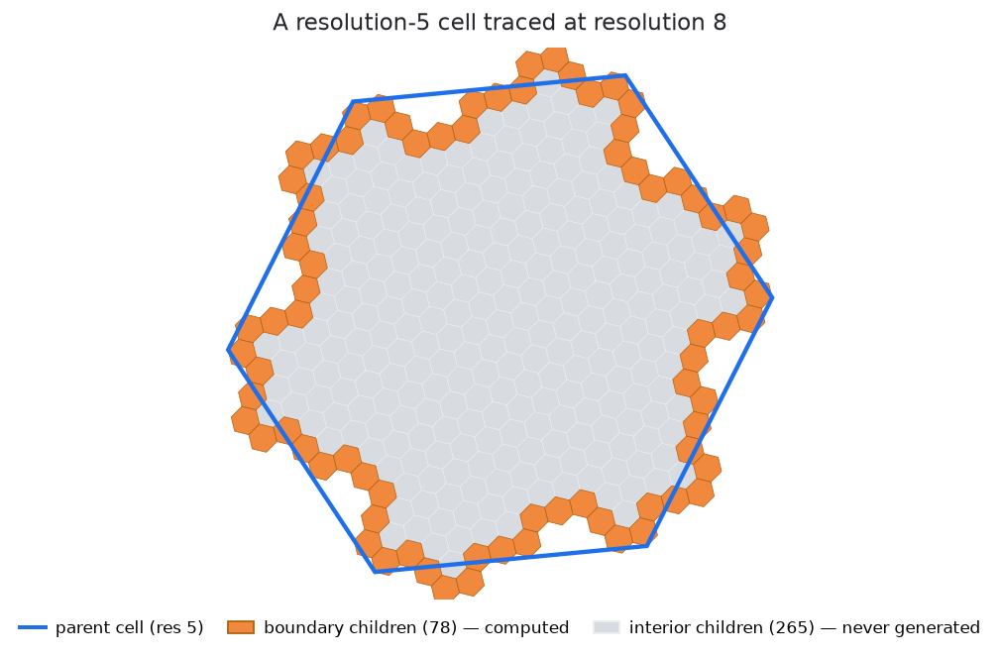

# H3-Boundary

Boundary cells and boundary polygons for Uber's H3 grid.

[Quick start](#quick-start){ .md-button .md-button--primary }
[View on GitHub](https://github.com/Khoshkhah/h3-boundary){ .md-button }

---

An H3 cell at one resolution contains thousands — or billions — of cells at finer resolutions. H3-Boundary works with the ones **on its edge**: it lists them, traces their outline, and builds polygons that safely contain them. Cost scales with the boundary, never with the interior.



```bash
pip install h3-boundary
```

---

## Quick start

Start from any H3 cell. Here we index downtown San Francisco at resolution 6 — a district-sized cell of about 36 km² — using `latlng_to_cell` from [h3-py](https://uber.github.io/h3-py/), which H3-Boundary already depends on.

```python
import h3
import h3_boundary as h3b

cell = h3.latlng_to_cell(lat=37.7759, lng=-122.4180, res=6)

# 1. Its boundary cells: the descendants at resolution 10 (block-sized cells)
#    that lie on its edge
edge = h3b.children_on_boundary_faces(cell, target_res=10)
len(edge)                                                # 240, out of 2,401 descendants

# 2. Its exact outline — the shape those descendants actually fill
outline = h3b.cell_boundary_from_children(cell, target_res=10)

# 3. That same outline, grown by a safety margin
safe = h3b.get_buffered_boundary_polygon(cell, intermediate_res=10)
safe["properties"]["buffer_meters"]                      # 75.9 — the margin added
```

Both polygons are GeoJSON Features, and both trace the boundary at resolution 10 — the difference is what they are for. The **outline** is the exact shape: draw it. On its own it is not safe to filter with, because cells finer than resolution 10 still poke slightly past it; **safe** pushes the edges out by one resolution-10 edge length (75.9 m), after which nothing can fall outside at *any* resolution. That is also why its parameter is called `intermediate_res` — there, tracing is only an intermediate step.

Why not just use the hexagon H3 draws for the cell? Because that hexagon is **not** where the descendants sit — they straddle it, as the figure above shows. Filtering fine-resolution data with it silently loses the cells along the edge (about 7% of them). [Buffered Polygons](buffering.md) has the full story.

## Working at scale

Interiors explode; boundaries stay manageable. Boundary size has a closed form — `3**(depth + 1) - 3`, where `depth` is how many resolution levels you descend — so it is known before computing anything. A resolution-2 cell has close to two billion descendants at resolution 13, but only 531,438 of them lie on its boundary, and you never need to build even those to use them:

```python
res, target = 2, 13                          # a country-sized cell, traced with ~44 m² cells
big = h3.latlng_to_cell(lat=37.7759, lng=-122.4180, res=res)

depth = target - res                         # 11 levels of subdivision between the two
total = 3 ** (depth + 1) - 3                 # 531,438 boundary cells, known without counting

ids = h3b.boundary_cell_ids(big, target_res=target)               # all of them, uint64, ~4 ms
mid = h3b.boundary_cell_at(big, target_res=target, n=total // 2)  # any one, in microseconds
h3b.boundary_rank(big, mid)                                       # the inverse — also a membership test
h3b.boundary_range(big, target_res=target, start=0, stop=100)     # any slice — stream it, or shard it
```

Disjoint slices reassemble into exactly the full boundary, so parallel workers need no coordination. [Boundary Indexing](indexing.md) explains how single cells are computed directly.

---

## Performance

Measured on Linux / Python 3.14; the C++ extension is used automatically when present.

| Operation | Boundary size | Time |
|---|---|---|
| Boundary cells — `children_on_boundary_faces` | 240 | 0.02 ms |
| Boundary cells, large — `boundary_cell_ids` | 531,438 | 4 ms |
| One cell by index — `boundary_cell_at` | any | 0.014 ms |
| Boundary polygon — `cell_boundary_from_children` | 240 | 1.6 ms |
| Buffered polygon, accurate | 240 | 6 ms |
| Buffered polygon, convex hull | 240 | 0.4 ms |

`boundary_cell_at` costs the same whether the boundary holds 78 cells or half a million.

---

## Guides

| Page | What's in it |
|---|---|
| [Interactive Demo](demo.md) | Boundary tracing and buffering, on a map |
| [Concepts](concepts.md) | How boundary tracing works |
| [Boundary Algorithms](algorithms.md) | Four ways to compute boundary cells, compared |
| [Boundary Indexing](indexing.md) | How the n-th boundary cell is computed directly |
| [Buffered Polygons](buffering.md) | Why buffering is needed, and what each mode guarantees |
| [API Reference](api_reference.md) | Every function |

## Notebooks

Three runnable demos live in [`notebook/`](https://github.com/Khoshkhah/h3-boundary/tree/master/notebook) — clone the repo and open them with `jupyter notebook`:

| Notebook | What it shows |
|---|---|
| [`demo_generation.ipynb`](https://github.com/Khoshkhah/h3-boundary/blob/master/notebook/demo_generation.ipynb) | Boundary tracing and buffering step by step, each stage drawn on a map |
| [`boundary_indexing_demo.ipynb`](https://github.com/Khoshkhah/h3-boundary/blob/master/notebook/boundary_indexing_demo.ipynb) | Large boundaries: bulk ids, reaching one cell directly, sharding |
| [`buffered_polygon_demo.ipynb`](https://github.com/Khoshkhah/h3-boundary/blob/master/notebook/buffered_polygon_demo.ipynb) | The three buffering modes compared, with a containment check for each |

## Installation

Ships as a source distribution. During install it compiles a C++ extension if `cmake`, a C++17 compiler and the Boost headers are present; otherwise it installs pure-Python and every function still works, just more slowly. Same results either way, verified by a parity test suite.

```python
import h3_boundary

h3_boundary.get_backend()        # 'cpp' or 'python'
h3_boundary.cpp_geom_available() # True if the C++ geometry functions exist
```

## License

MIT — see [LICENSE](https://github.com/Khoshkhah/h3-boundary/blob/master/LICENSE).
