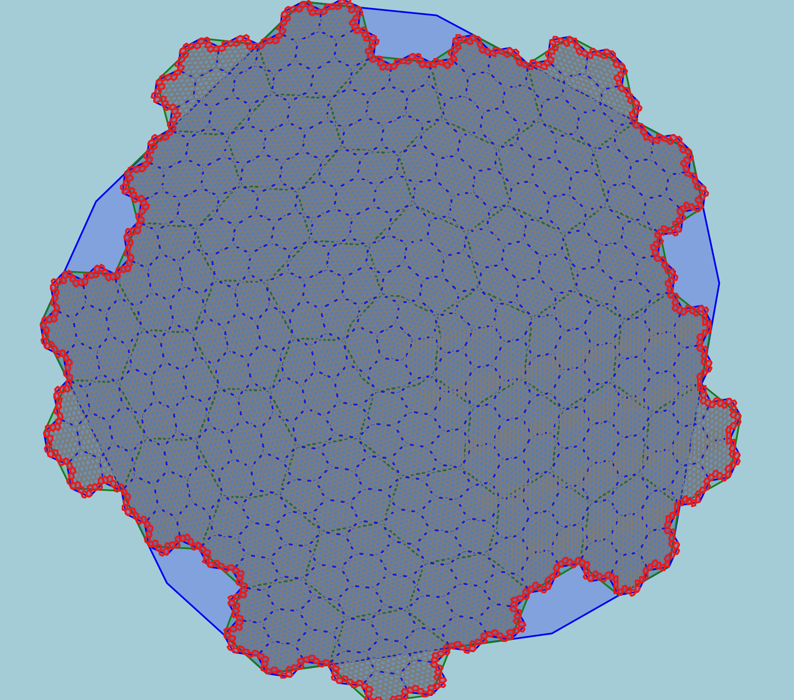

# H3-Boundary

This repository provides utility functions for working with H3 hexagonal grid cells, specifically focusing on tracing and identifying cells that lie on specific boundary faces of their parent or ancestor cells.


---

## Overview

The [H3](https://github.com/uber/h3) geospatial indexing system divides the world into a hierarchy of hexagonal cells. This project adds logic for:

- Mapping boundary face relationships across resolutions.
- Identifying how H3 cells align with their parent's or ancestor’s faces.
- Querying children cells that lie on specific boundaries.

This is useful for applications involving spatial querying, adjacency filtering, custom border rendering, and multi-resolution geographic operations.


---

## Features

- `trace_cell_to_ancestor_faces`: Determine which boundary faces of an ancestor cell a given H3 cell lies on.
- `trace_cell_to_parent_faces`: A specialized version of the above, focusing on the immediate parent's boundary faces.
- `cell_to_coarsest_ancestor_on_faces`: Find the lowest resolution ancestor cell for which a target cell still lies on specified boundary faces.
- `children_on_boundary_faces`: Efficiently identify all child cells at a target resolution that lie on the specified boundary faces of a parent cell.


---


## Installation

This project requires the `h3-py` library.

```bash
pip install h3
```

To use the utilities, simply include the `h3_boundary_utils.py` file in your project.

---


## Sample Output

Here's an example of a hexagonal pattern, which could be generated or analyzed using H3-Boundary utilities:




---

## Contributing

Contributions are welcome! Please feel free to open issues or submit pull requests.

---

## License

This project is licensed under the MIT License. See the [LICENSE](LICENSE) file for details.